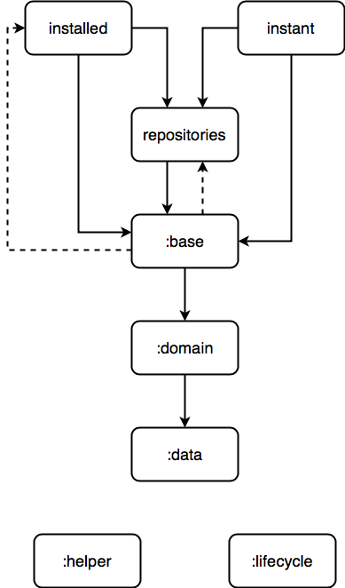

This project is used as a reference for the Android team at TIKI.

Architecture
============

Clean Architecture
------------------
We use Clean Architecture, inspired by the article https://github.com/android10/Android-CleanArchitecture-Kotlin. Thanks [@android10](https://github.com/android10) a lot.

Structure
---------

Recommended by Google to be able to use the Instant App feature.

 * `data` -> data layer
 * `domain` -> domain layer
 * `presentation` -> presentation layer

   * `base` -> base feature module
   * `repositories` -> implementation of repository listing feature

 * `installed` -> application module.
 * `instant` -> instant app module.

Reference
---------

 * https://github.com/android10/Android-CleanArchitecture-Kotlin
 * https://youtu.be/tYf9ivnQ0eI
 * https://github.com/googlesamples/android-instant-apps

Coding style
------------
You can refer here here: https://github.com/talenguyen/java-code-styles.

License
=======

    Copyright 2018 TIKI
 
    Licensed under the Apache License, Version 2.0 (the "License");
    you may not use this file except in compliance with the License.
    You may obtain a copy of the License at

       http://www.apache.org/licenses/LICENSE-2.0

    Unless required by applicable law or agreed to in writing, software
    distributed under the License is distributed on an "AS IS" BASIS,
    WITHOUT WARRANTIES OR CONDITIONS OF ANY KIND, either express or implied.
    See the License for the specific language governing permissions and
    limitations under the License.

 [1]: https://github.com/android10/Android-CleanArchitecture-Kotlin
 [2]: https://youtu.be/tYf9ivnQ0eI
 [3]: https://github.com/googlesamples/android-instant-apps
 [4]: https://github.com/talenguyen/java-code-styles
